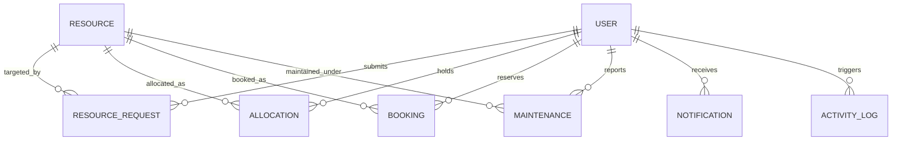

# Database Design & Schemas: MongoDB Atlas

The **Office Resource Management System** uses MongoDB with Mongoose ODM. All models include automated timestamps (`createdAt`, `updatedAt`) and MongoDB ObjectId relationships.

---

## 1. Entity Relationship Overview

---

## 2. Models & Schema Definitions

### 1. `User` Model
- `name` (String, required)
- `email` (String, required, unique, lowercase)
- `password` (String, required, hashed with bcrypt)
- `role` (String, enum: `['ADMIN', 'EMPLOYEE']`, default: `'EMPLOYEE'`)
- `department` (String, default: `'General'`)
- `phone` (String)
- `isActive` (Boolean, default: `true`)

### 2. `Resource` Model
- `resourceId` (String, required, unique, uppercase, e.g. `'OR-101'`)
- `name` (String, required)
- `category` (String, enum: `['Laptop', 'Monitor', 'Projector', 'Meeting Room', 'Printer', 'Other']`)
- `description` (String)
- `location` (String, required)
- `status` (String, enum: `['AVAILABLE', 'ALLOCATED', 'BOOKED', 'UNDER_MAINTENANCE', 'INACTIVE']`)
- `isBookable` (Boolean, default: `false`)
- `createdBy` (ObjectId -> User)

### 3. `ResourceRequest` Model
- `employee` (ObjectId -> User, required)
- `resource` (ObjectId -> Resource, required)
- `reason` (String, required)
- `status` (String, enum: `['PENDING', 'APPROVED', 'REJECTED']`, default: `'PENDING'`)
- `requestedAt` (Date, default: `Date.now`)
- `reviewedBy` (ObjectId -> User)
- `reviewedAt` (Date)
- `rejectionReason` (String)

### 4. `Allocation` Model
- `resource` (ObjectId -> Resource, required)
- `employee` (ObjectId -> User, required)
- `request` (ObjectId -> ResourceRequest)
- `allocatedBy` (ObjectId -> User, required)
- `allocatedAt` (Date, default: `Date.now`)
- `expectedReturnDate` (Date)
- `returnedAt` (Date)
- `status` (String, enum: `['ACTIVE', 'RETURN_REQUESTED', 'RETURNED']`, default: `'ACTIVE'`)
- `notes` (String)

### 5. `Booking` Model
- `resource` (ObjectId -> Resource, required)
- `bookedBy` (ObjectId -> User, required)
- `title` (String, required)
- `date` (String, YYYY-MM-DD, required)
- `startTime` (String, HH:mm, required)
- `endTime` (String, HH:mm, required)
- `status` (String, enum: `['UPCOMING', 'ONGOING', 'COMPLETED', 'CANCELLED']`, default: `'UPCOMING'`)

### 6. `Maintenance` Model
- `resource` (ObjectId -> Resource, required)
- `reportedBy` (ObjectId -> User, required)
- `issue` (String, required)
- `priority` (String, enum: `['LOW', 'MEDIUM', 'HIGH']`, default: `'MEDIUM'`)
- `status` (String, enum: `['PENDING', 'IN_PROGRESS', 'RESOLVED']`, default: `'PENDING'`)
- `resolutionNote` (String)
- `resolvedAt` (Date)

### 7. `Notification` Model
- `user` (ObjectId -> User, required)
- `message` (String, required)
- `type` (String, enum: `['REQUEST', 'ALLOCATION', 'BOOKING', 'MAINTENANCE', 'SYSTEM']`)
- `isRead` (Boolean, default: `false`)

### 8. `ActivityLog` Model
- `user` (ObjectId -> User)
- `action` (String, required)
- `entity` (String, required)
- `entityId` (String)
- `description` (String, required)
- `timestamp` (Date, default: `Date.now`)

---

## 3. Critical Database Indexes

| Collection | Indexed Fields | Index Purpose |
|---|---|---|
| `users` | `{ email: 1 }` (unique) | Fast login lookup and email uniqueness guarantee |
| `resources` | `{ resourceId: 1 }` (unique) | Enforces company hardware tag uniqueness |
| `resources` | `{ status: 1 }, { category: 1 }` | Fast filtering for available and bookable items |
| `bookings` | `{ resource: 1, date: 1, status: 1 }` | Fast index scan for conflict overlap evaluation |
| `allocations` | `{ resource: 1, status: 1 }` | Prevents duplicate physical allocation |
| `resourcerequests` | `{ employee: 1, status: 1 }` | Instant fetch of pending employee requests |
| `activitylogs` | `{ timestamp: -1 }` | High performance chronological log streaming |
